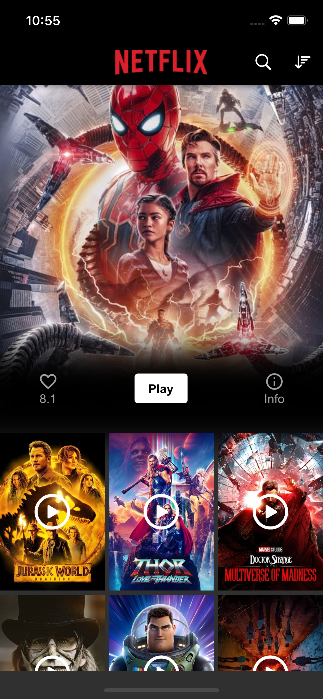
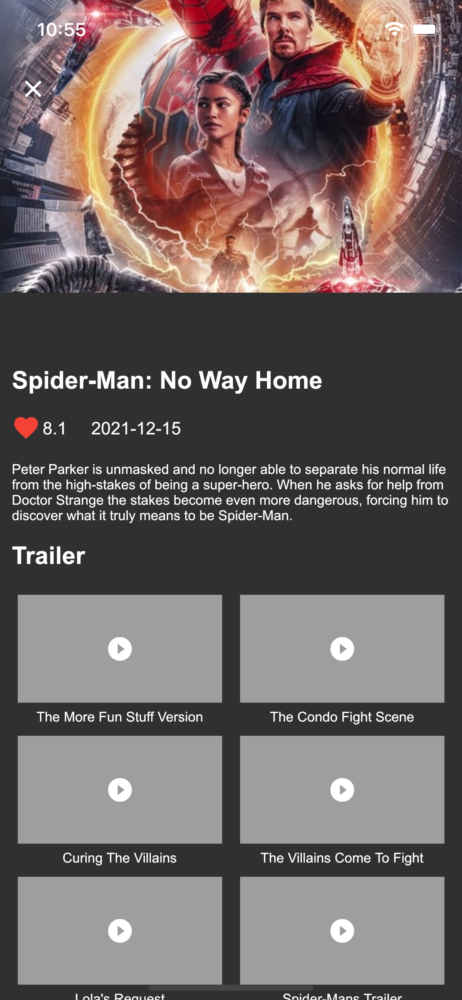
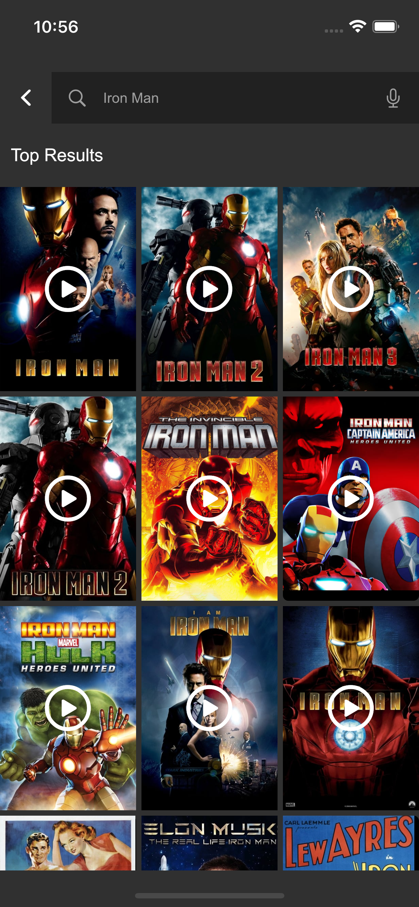

# Movie app using Bloc Pattern

Netflix app clone flutter project using flutter_bloc package.

## Screenshots

    

## Folder structure

```bash
.
├── core
│   ├── constant
│   ├── data_sources
│   ├── enums
│   ├── exceptions
│   ├── managers
│   ├── navigation
│   ├── models
│   ├── repositories
│   ├── services
│   └── utils
└── ui
    ├── shared
    ├── views
    └── widgets
```

## Features

### Master branch

- [x] json serialization
- [x] connectivity service
- [x] http service
- [x] navigation service
- [x] key storage service
- [x] local storage service (NoSQL)
- [x] life cycle manager to start/stop background services
- [x] snack bar service

## Example pages included

- Home View (Renders a list of movies fetched from JSON place holder API [TMDB])
- Movie Details Viw (Dynamic view that loads the movie information)
- Search View (Dynamic view that loads the movies list on query)

## API Documentation

- [TMDB api documentation](https://developers.themoviedb.org/3/getting-started/introduction)
